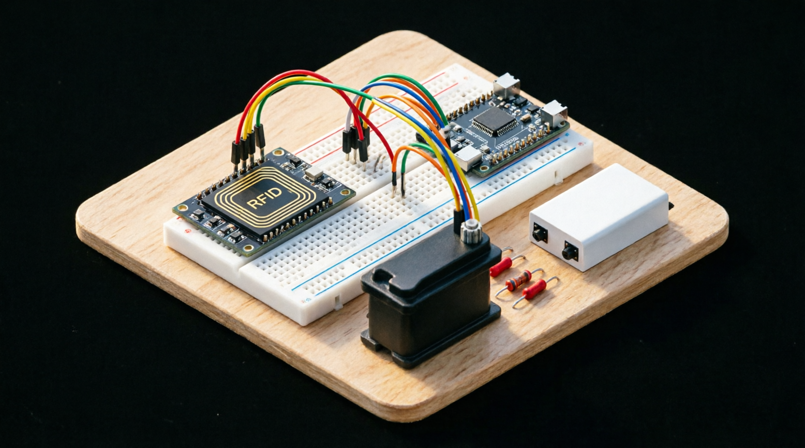

# 🚪 RFID Access Control System - IoT Final Project


> **UUST 302B THIRD YEAR - Internet of Things Course Final Project**  
> A comprehensive RFID-based access control system integrating Spring Boot backend, React frontend, and ESP32 hardware with MQTT communication.

---

## 📸 Project Overview



*Figure 1: Complete RFID Access Control System Architecture*

This project implements a complete **IoT-based RFID Access Control System** that combines modern web technologies with embedded hardware to create a secure, scalable, and real-time door access management solution. The system enables organizations to register personnel, manage RFID cards, monitor access events, and control physical door locks through a unified platform.

### 🎯 Core Objectives

- **Secure Access Management**: Implement card-based authentication with real-time verification
- **Hardware-Software Integration**: Bridge web applications with physical devices via MQTT
- **Real-time Monitoring**: Provide live status updates for doors, devices, and access events
- **User-friendly Interface**: Create intuitive web UIs for administrators and users
- **Scalable Architecture**: Design modular components for easy expansion

---

## 🏗️ System Architecture

```
┌─────────────────────────────────────────────────────────────────────┐
│                     RFID ACCESS CONTROL SYSTEM                       │
├─────────────────────────────────────────────────────────────────────┤
│                                                                       │
│  ┌──────────────┐      HTTP/REST      ┌──────────────┐               │
│  │   React      │ ◄════════════════► │  Spring Boot │               │
│  │  Frontend    │   (JSON over HTTP)  │   Backend    │               │
│  │  (Port 5173) │                     │ (Port 8081)  │               │
│  └──────────────┘                     └──────┬───────┘               │
│                                              │                        │
│                                       ┌──────▼───────┐               │
│                                       │   SQLite     │               │
│                                       │  Database    │               │
│                                       └──────┬───────┘               │
│                                              │ MQTT                   │
│                                       ┌──────▼───────┐               │
│                                       │  MQTT Broker │               │
│                                       │  (Mosquitto) │               │
│                                       └──────┬───────┘               │
│                                              │                        │
│                                       ┌──────▼───────┐               │
│                                       │   ESP32      │               │
│                                       │  Hardware    │               │
│                                       └──────┬───────┘               │
│                                              │                        │
│                                    ┌─────────▼─────────┐             │
│                                    │ MFRC522 + Servo   │             │
│                                    │ + LEDs + WiFi     │             │
│                                    └───────────────────┘             │
└─────────────────────────────────────────────────────────────────────┘
```

### 🔗 Component Interaction Flow

1. **User Action** → React frontend sends HTTP request
2. **Backend Processing** → Spring Boot validates and processes request
3. **Database Operation** → SQLite stores/retrieves card and log data
4. **MQTT Communication** → Backend publishes commands to ESP32
5. **Hardware Execution** → ESP32 reads RFID cards and controls door lock
6. **Status Feedback** → ESP32 publishes status back through MQTT
7. **UI Update** → Frontend receives updates and refreshes display

---

## 📦 Project Structure

```
rfid-control/
│
├── 📁 Backend-SpringBoot/              # Spring Boot Backend Application
│   ├── src/main/java/com/rfid/rfid_control/
│   │   ├── config/                     # Configuration classes
│   │   │   ├── CorsConfig.java        # CORS policy configuration
│   │   │   └── MqttConfig.java        # MQTT broker configuration
│   │   ├── controller/                 # REST API endpoints
│   │   │   └── AccessController.java  # Main API controller
│   │   ├── model/                      # Data models
│   │   │   ├── dto/                    # Data Transfer Objects
│   │   │   │   ├── RegisterRequest.java
│   │   │   │   └── RegisterResponse.java
│   │   │   ├── AccessLog.java         # Access event entity
│   │   │   └── Card.java              # RFID card entity
│   │   ├── repository/                 # JPA repositories
│   │   │   ├── AccessLogRepository.java
│   │   │   └── CardRepository.java
│   │   ├── service/                    # Business logic
│   │   │   ├── AccessService.java     # Access control logic
│   │   │   └── MqttService.java       # MQTT messaging service
│   │   └── RfidControlApplication.java # Application entry point
│   ├── src/main/resources/
│   │   ├── static/index.html          # Static HTML fallback
│   │   ├── templates/index.html       # Thymeleaf template
│   │   └── application.yaml           # Application configuration
│   ├── pom.xml                         # Maven dependencies
│   ├── mvnw.cmd                        # Maven wrapper
│   └── README.md                       # Backend documentation
│
├── 📁 rfid-frontend/                   # React Frontend Application
│   ├── src/
│   │   ├── pages/                      # Page components
│   │   │   ├── Dashboard.jsx          # Main dashboard
│   │   │   ├── RegisterPerson.jsx     # Card registration form
│   │   │   └── RegisteredPeople.jsx   # Registered cards list
│   │   ├── services/                   # API integration
│   │   │   └── api.js                 # Axios configuration
│   │   ├── data/                       # Mock data
│   │   │   └── mockData.js            # Offline development data
│   │   ├── App.jsx                     # Main app with routing
│   │   ├── main.jsx                    # Entry point
│   │   └── index.css                   # Global styles
│   ├── package.json                    # Node.js dependencies
│   ├── vite.config.js                  # Vite configuration
│   ├── eslint.config.js                # ESLint rules
│   └── README.md                       # Frontend documentation
│
├── 📁 sketch_server-Rfid/              # ESP32 Arduino Sketch
│   ├── sketch_server-Rfid.ino         # Main firmware code
│   ├── README.md                       # Hardware setup guide
│   └── DOCUMENTATION.md                # Detailed technical docs
│
├── 📄 1781729470.png                   # System architecture diagram
├── 📄 .gitignore                       # Git ignore rules
└── 📄 README.md                        # This file (main documentation)
```

---

## ✨ Key Features

### 🔐 Access Control Features

| Feature | Description | Status |
|---------|-------------|--------|
| **RFID Card Scanning** | Read 13.56 MHz RFID tags via MFRC522 | ✅ Implemented |
| **Real-time Verification** | Instant card validation against database | ✅ Implemented |
| **Door Lock Control** | Servo-controlled physical door mechanism | ✅ Implemented |
| **Auto-Close Safety** | Automatic door closure after timeout | ✅ Implemented |
| **Access Logging** | Comprehensive audit trail of all events | ✅ Implemented |
| **Visual Indicators** | Green/Red LED feedback for access decisions | ✅ Implemented |

### 💻 Web Interface Features

| Feature | Description | Status |
|---------|-------------|--------|
| **Dashboard** | Real-time system monitoring and status | ✅ Implemented |
| **Card Registration** | User-friendly form for enrolling new cards | ✅ Implemented |
| **Registered Cards List** | View and manage all authorized personnel | ✅ Implemented |
| **ESP32 Status Monitor** | Live device connectivity and health info | ✅ Implemented |
| **Door State Tracking** | Real-time lock/unlock status with countdown | ✅ Implemented |
| **Mock Data Support** | Offline development capability | ✅ Implemented |

### 🛠️ Technical Features

| Feature | Description | Status |
|---------|-------------|--------|
| **MQTT Communication** | Reliable IoT messaging protocol | ✅ Implemented |
| **RESTful API** | Standard HTTP/JSON interface | ✅ Implemented |
| **SQLite Database** | Lightweight embedded data persistence | ✅ Implemented |
| **CORS Support** | Cross-origin resource sharing | ✅ Implemented |
| **Error Handling** | Graceful degradation and fallbacks | ✅ Implemented |
| **Health Checks** | System component monitoring | ✅ Implemented |

---

## 🚀 Quick Start Guide

### Prerequisites Checklist

Before starting, ensure you have:

- ☕ **Java 25+** installed ([Download](https://www.oracle.com/java/technologies/downloads/))
- 🟢 **Node.js 18+** and npm ([Download](https://nodejs.org/))
- 🛠️ **Maven 3.6+** (or use included `mvnw` wrapper)
- 📡 **MQTT Broker** (Mosquitto recommended)
- 🔧 **Arduino IDE** (for ESP32 programming)
- 📦 **Git** for version control

### Step-by-Step Setup

#### 1️⃣ Clone the Repository

```bash
git clone <repository-url>
cd rfid-control
```

#### 2️⃣ Backend Setup (Spring Boot)

```bash
# Navigate to backend directory
cd Backend-SpringBoot

# Build the project
./mvnw clean package

# Run the application
./mvnw spring-boot:run

# Backend will start at http://localhost:8081
```

**Verify Backend:**
```bash
curl http://localhost:8081/api/health
# Expected: {"status":"UP"}
```

#### 3️⃣ Frontend Setup (React)

```bash
# Open new terminal, navigate to frontend
cd rfid-frontend

# Install dependencies
npm install

# Start development server
npm run dev

# Frontend will start at http://localhost:5173
```

**Access the Application:**
- Open browser and navigate to `http://localhost:5173`
- You should see the dashboard page

#### 4️⃣ ESP32 Hardware Setup

See detailed instructions in [`sketch_server-Rfid/README.md`](sketch_server-Rfid/README.md)

**Quick Steps:**
1. Install required Arduino libraries (MFRC522, PubSubClient, ArduinoJson, ESP32Servo)
2. Configure WiFi credentials and MQTT broker IP in `.ino` file
3. Wire hardware components according to pin diagram
4. Upload sketch to ESP32 via Arduino IDE
5. Monitor Serial Console (115200 baud) for status messages

#### 5️⃣ MQTT Broker Setup

```bash
# Install Mosquitto (Ubuntu/Debian)
sudo apt-get install mosquitto mosquitto-clients

# Start Mosquitto broker
mosquitto -v

# Or run as background service
sudo systemctl start mosquitto
sudo systemctl enable mosquitto
```

**Test MQTT:**
```bash
# Subscribe to all topics
mosquitto_sub -h localhost -t "#" -v

# Publish test message
mosquitto_pub -h localhost -t "test/topic" -m "Hello MQTT"
```

---

## 📚 Documentation Index

Comprehensive documentation is available for each component:

| Component | Documentation | Purpose |
|-----------|--------------|---------|
| **Main README** | [README.md](README.md) | Project overview and quick start |
| **Backend** | [Backend-SpringBoot/README.md](Backend-SpringBoot/README.md) | Spring Boot API, database, MQTT |
| **Frontend** | [rfid-frontend/README.md](rfid-frontend/README.md) | React app, pages, API integration |
| **Hardware Guide** | [sketch_server-Rfid/README.md](sketch_server-Rfid/README.md) | ESP32 wiring, libraries, setup |
| **Technical Docs** | [sketch_server-Rfid/DOCUMENTATION.md](sketch_server-Rfid/DOCUMENTATION.md) | Complete hardware specification |

---

## 🔌 API Reference

### Base URL: `http://localhost:8081/api`

#### Authentication Endpoints

| Method | Endpoint | Description | Request Body | Response |
|--------|----------|-------------|--------------|----------|
| `POST` | `/register` | Register new RFID card | `{cardId, personName, email, department}` | `{success, message}` |

#### Card Management Endpoints

| Method | Endpoint | Description | Parameters | Response |
|--------|----------|-------------|------------|----------|
| `GET` | `/cards` | Get all registered cards | None | `{cards: [], total: N}` |
| `DELETE` | `/cards/{id}` | Deactivate card | Path: id | `{success, message}` |

#### Monitoring Endpoints

| Method | Endpoint | Description | Response |
|--------|----------|-------------|----------|
| `GET` | `/health` | Backend health check | `{status: "UP"}` |
| `GET` | `/logs` | Get access logs | `{logs: [], total: N}` |
| `GET` | `/esp32/status` | Get ESP32 device status | Device info JSON |
| `GET` | `/door/status` | Get current door state | Door state JSON |

#### Example: Register New Card

```bash
curl -X POST http://localhost:8081/api/register \
  -H "Content-Type: application/json" \
  -d '{
    "cardId": "A1B2C3D4",
    "personName": "John Doe",
    "email": "john@example.com",
    "department": "Engineering"
  }'
```

**Response:**
```json
{
  "success": true,
  "message": "Card registered successfully"
}
```

#### Example: Get All Cards

```bash
curl http://localhost:8081/api/cards
```

**Response:**
```json
{
  "cards": [
    {
      "id": 1,
      "cardId": "A1B2C3D4",
      "personName": "John Doe",
      "email": "john@example.com",
      "department": "Engineering",
      "registeredAt": "2026-06-18T01:00:00Z",
      "isActive": true
    }
  ],
  "total": 1
}
```

---

## 📨 MQTT Topics & Messages

### Topic Structure

| Topic | Direction | Payload Type | Purpose | QoS |
|-------|-----------|--------------|---------|-----|
| `access/check` | ESP32 → Server | Plain text (UID) | Verify card access | 0 |
| `access/response` | Server → ESP32 | Plain text | Grant/deny access | 0 |
| `access/mode/set` | Server → ESP32 | JSON | Change operation mode | 0 |
| `access/scan_result` | ESP32 → Server | JSON | Registration scan result | 0 |
| `esp32/status` | ESP32 → Server | JSON | Periodic device status | 0 |

### Message Formats

#### 1. Access Check (ESP32 → Server)

**Topic:** `access/check`  
**Payload:**
```
A1B2C3D4
```

#### 2. Access Response (Server → ESP32)

**Topic:** `access/response`  
**Payload:**
```
ALLOWED
```
or
```
DENIED
```

#### 3. Mode Command (Server → ESP32)

**Topic:** `access/mode/set`  
**Payload:**
```json
{
  "mode": "register",
  "session_id": "REG-20260618-001",
  "timeout": 30
}
```

#### 4. Status Update (ESP32 → Server)

**Topic:** `esp32/status`  
**Payload:**
```json
{
  "device_id": "ESP32-RFID-01",
  "ip_address": "192.168.1.100",
  "wifi_strength": -45,
  "door_state": "LOCKED",
  "scan_mode": "ACCESS",
  "timestamp": 123456789
}
```

---

## 🛠️ Technology Stack

### Backend Technologies

| Technology | Version | Purpose |
|------------|---------|---------|
| **Java** | 25 | Programming language |
| **Spring Boot** | 4.0.6 | Web framework |
| **Spring Data JPA** | Latest | ORM and database access |
| **Hibernate** | Latest | JPA implementation |
| **SQLite** | 3.45.1.0 | Embedded database |
| **Eclipse Paho MQTT** | 1.2.5 | MQTT client library |
| **Lombok** | Latest | Code generation |
| **Gson** | Latest | JSON serialization |
| **Jackson** | Latest | JSON processing |
| **Maven** | 3.6+ | Build tool and dependency management |

### Frontend Technologies

| Technology | Version | Purpose |
|------------|---------|---------|
| **React** | 19.2.6 | UI component library |
| **Vite** | 8.0.12 | Build tool and dev server |
| **React Router DOM** | 7.17.0 | Client-side routing |
| **Axios** | 1.17.0 | HTTP client |
| **React Icons** | 5.6.0 | Icon library |
| **ESLint** | 10.3.0 | Code linting |

### Hardware Technologies

| Component | Specification | Purpose |
|-----------|---------------|---------|
| **ESP32 DevKit** | Dual-core, WiFi, Bluetooth | Microcontroller |
| **MFRC522** | 13.56 MHz RFID/NFC | Card reader |
| **SG90/MG996R Servo** | 180° rotation | Door lock actuator |
| **LEDs** | Green & Red | Visual indicators |
| **WiFi** | 802.11 b/g/n | Network connectivity |
| **MQTT** | v3.1.1 | Messaging protocol |

---

## 🧪 Testing

### Backend Testing

```bash
cd Backend-SpringBoot

# Run all tests
./mvnw test

# Run specific test class
./mvnw test -Dtest=AccessControllerTest

# Generate coverage report
./mvnw jacoco:report
```

### Frontend Testing

```bash
cd rfid-frontend

# Run ESLint
npm run lint

# Run tests (if configured)
npm test

# Build and preview production
npm run build
npm run preview
```

### Hardware Testing

1. **Serial Monitor Debugging**
   - Open Arduino IDE Serial Monitor
   - Set baud rate to 115200
   - Observe initialization and operational messages

2. **MQTT Message Testing**
   ```bash
   # Monitor all ESP32 messages
   mosquitto_sub -h 10.81.117.180 -t "esp32/#" -v
   
   # Send test command
   mosquitto_pub -h 10.81.117.180 -t "access/mode/set" \
     -m '{"mode":"register","session_id":"TEST-001","timeout":30}'
   ```

3. **RFID Reader Diagnostics**
   - System automatically checks reader every 30 seconds
   - Serial output shows reader version and status
   - Test with multiple RFID cards

---

## 🔐 Security Considerations

> ⚠️ **Important**: This project is designed for **educational purposes**. For production deployment, implement the following security measures:

### Network Security

- ✅ Enable HTTPS/TLS for all HTTP communications
- ✅ Use WSS (WebSocket Secure) for MQTT over TLS
- ✅ Implement VPN or private network for MQTT broker
- ✅ Restrict CORS to specific trusted domains
- ✅ Enable firewall rules to limit port access

### Authentication & Authorization

- ✅ Implement JWT (JSON Web Tokens) for API authentication
- ✅ Add MQTT broker username/password authentication
- ✅ Implement role-based access control (RBAC)
- ✅ Add API rate limiting to prevent abuse
- ✅ Use OAuth2 for third-party integrations

### Data Security

- ✅ Encrypt sensitive data at rest (AES-256)
- ✅ Hash passwords using bcrypt or Argon2
- ✅ Implement input validation and sanitization
- ✅ Use prepared statements to prevent SQL injection
- ✅ Regularly backup database with encryption

### Hardware Security

- ✅ Physically secure ESP32 and RFID reader
- ✅ Implement tamper detection mechanisms
- ✅ Use unique device certificates for MQTT
- ✅ Validate all incoming MQTT messages
- ✅ Implement watchdog timer for reliability

### Environment Variables

Store sensitive configuration in environment variables:

```yaml
# application.yaml (Backend)
spring:
  datasource:
    url: ${DB_URL}
    username: ${DB_USERNAME}
    password: ${DB_PASSWORD}

mqtt:
  broker-url: ${MQTT_BROKER_URL}
  username: ${MQTT_USERNAME}
  password: ${MQTT_PASSWORD}
```

---

## 🤝 Contributing

We welcome contributions! Please follow these guidelines:

### Contribution Workflow

1. **Fork** the repository
2. **Create** a feature branch (`git checkout -b feature/amazing-feature`)
3. **Commit** your changes (`git commit -m 'Add amazing feature'`)
4. **Push** to the branch (`git push origin feature/amazing-feature`)
5. **Open** a Pull Request

### Development Guidelines

#### Code Style

- **Java**: Follow Google Java Style Guide
- **JavaScript/React**: Use ESLint configuration provided
- **Arduino C++**: Follow Arduino coding conventions
- **Comments**: Write clear, concise comments for complex logic

#### Commit Messages

Use conventional commit format:

```
type(scope): description

[optional body]

[optional footer]
```

**Types:**
- `feat`: New feature
- `fix`: Bug fix
- `docs`: Documentation changes
- `style`: Code style changes
- `refactor`: Code refactoring
- `test`: Adding tests
- `chore`: Maintenance tasks

**Example:**
```
feat(backend): add JWT authentication

Implement JWT-based authentication for API endpoints.
- Add JWT token generation and validation
- Create authentication filter
- Update user login endpoint

Closes #123
```

#### Testing Requirements

- Write unit tests for new backend features
- Ensure all existing tests pass
- Test frontend components manually
- Verify hardware changes with physical testing

#### Documentation

- Update README files for new features
- Add inline code comments
- Update API documentation
- Include usage examples

---

## 📄 License

This project is licensed under the **MIT License**. See the [LICENSE](LICENSE) file for complete details.

### Summary

- ✅ Free to use for personal and commercial projects
- ✅ Modify and distribute as needed
- ✅ Include original copyright notice
- ❌ No warranty provided
- ❌ Authors not liable for damages

---

## 👥 Authors & Credits

### Project Team

- **Course**: UUST 302B THIRD YEAR - Internet of Things
- **Institution**: [Your University Name]
- **Academic Year**: 2025-2026
- **Project Type**: Final Course Project

### Technologies & Libraries

Special thanks to the creators and maintainers of:

- **Spring Framework** team for the excellent backend framework
- **React** community for the powerful UI library
- **Espressif** for the versatile ESP32 platform
- **Eclipse Foundation** for Paho MQTT client
- **Arduino** community for embedded systems support
- **Open source contributors** whose libraries made this project possible

### Acknowledgments

- Course instructors for guidance and support
- Peers for code reviews and feedback
- Online communities for troubleshooting assistance
- Documentation authors for comprehensive references

---

## 📞 Support & Contact

### Getting Help

- 📧 **Email**: [your.email@example.com]
- 💬 **Course Forum**: [Forum Link]
- 🐛 **Issue Tracker**: [GitHub Issues](../../issues)
- 📚 **Documentation**: See individual component READMEs

### Reporting Issues

When reporting bugs, please include:

1. **Environment Details**
   - Operating System and version
   - Java/Node.js/Arduino IDE versions
   - Browser information (for frontend issues)

2. **Steps to Reproduce**
   - Clear, numbered steps
   - Expected vs actual behavior
   - Screenshots if applicable

3. **Logs and Error Messages**
   - Backend console output
   - Browser console errors
   - ESP32 serial monitor output
   - MQTT broker logs

4. **Code Snippets**
   - Relevant code sections
   - Configuration files
   - API request/response examples

---

## 🌟 Show Your Support

If this project helped you learn about IoT systems, embedded programming, or full-stack development, please consider:

- ⭐️ **Star** this repository on GitHub
- 🍴 **Fork** it for your own projects
- 📢 **Share** it with classmates and colleagues
- 💡 **Contribute** improvements and bug fixes
- 📝 **Provide feedback** for future enhancements

---

## 📈 Future Enhancements

Potential improvements for future iterations:

### Short-term Goals

- [ ] Add user authentication and authorization
- [ ] Implement mobile app (React Native/Flutter)
- [ ] Add email notifications for access events
- [ ] Create admin dashboard with analytics
- [ ] Support multiple ESP32 devices

### Long-term Vision

- [ ] Integrate facial recognition alongside RFID
- [ ] Add biometric authentication options
- [ ] Implement cloud-based deployment (AWS/Azure)
- [ ] Create multi-tenant architecture
- [ ] Add AI-powered anomaly detection
- [ ] Support blockchain-based audit trails

---

<div align="center">

**Made with ❤️ for IoT Education**

[UUST 302B - Internet of Things Course](#) · [Final Project 2026](#)

[Report Bug](../../issues) · [Request Feature](../../issues) · [View Documentation](#-documentation-index)

</div>

---

## 📑 Table of Contents

- [📸 Project Overview](#-project-overview)
- [🏗️ System Architecture](#️-system-architecture)
- [📦 Project Structure](#-project-structure)
- [✨ Key Features](#-key-features)
- [🚀 Quick Start Guide](#-quick-start-guide)
- [📚 Documentation Index](#-documentation-index)
- [🔌 API Reference](#-api-reference)
- [📨 MQTT Topics & Messages](#-mqtt-topics--messages)
- [🛠️ Technology Stack](#️-technology-stack)
- [🧪 Testing](#-testing)
- [🔐 Security Considerations](#-security-considerations)
- [🤝 Contributing](#-contributing)
- [📄 License](#-license)
- [👥 Authors & Credits](#-authors--credits)
- [📞 Support & Contact](#-support--contact)
- [🌟 Show Your Support](#-show-your-support)
- [📈 Future Enhancements](#-future-enhancements)

---

*Last Updated: June 18, 2026*
